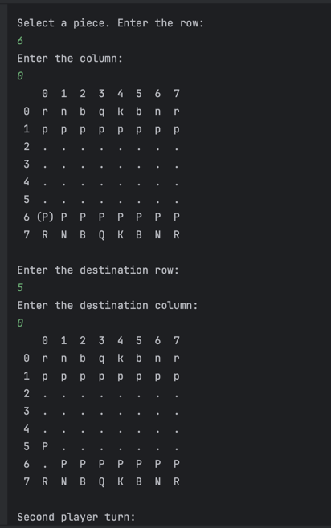
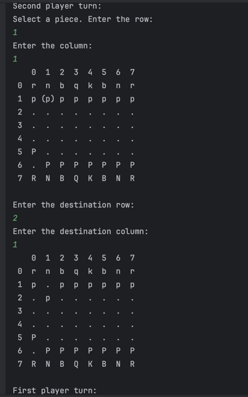
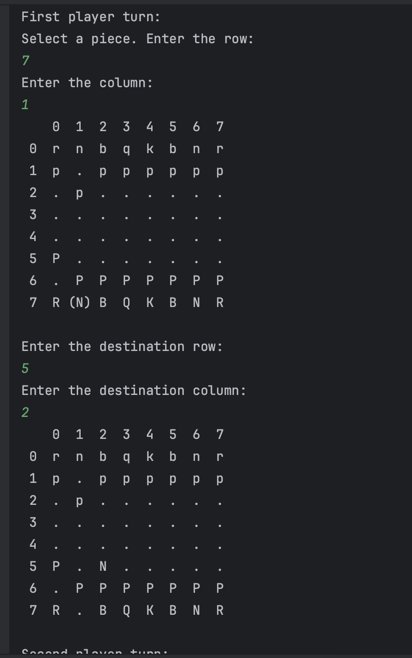
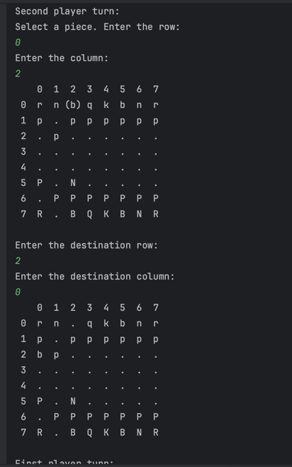
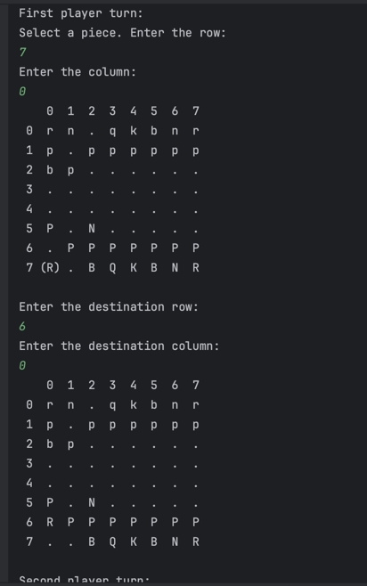
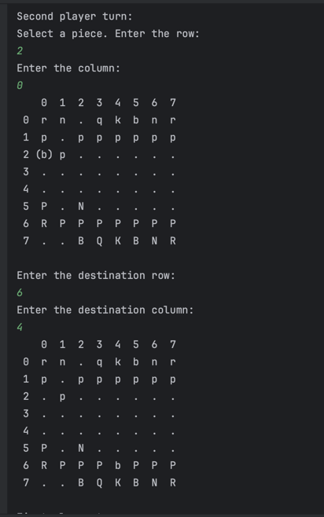
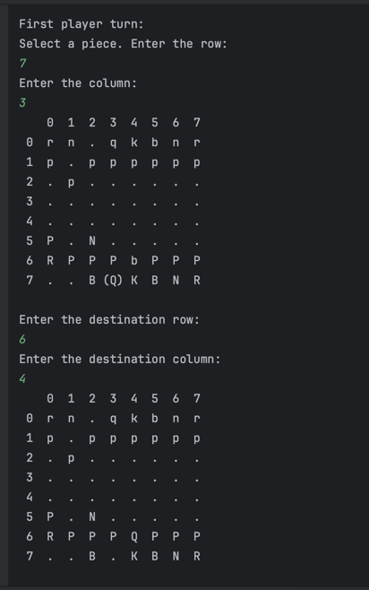

# Übung 6 - Lösung

## 1. Chess (src/chess/)

### Lösungsidee
Zuerst wird eine gemeinsame Basisklasse Chessman für alle Spielfiguren erstellt. Jede Spielfigur bietet folgende Funktionalität:
- die Farbe der Mannschaft liefert
- eine symbolische Darstellung in Form eines ASCII Zeichens liefert
- die Frage beantwortet, ob es sich um eine „essentielle“ Figur handelt, deren Verlust das Ende des Spiels bedeuten würde
  
Dann werden abgeleitete Klassen für die typischen Schachfiguren erstellt. Jede Spielfigur bietet folgende Funktionalität:
- ob sich die Figur von Position (from_row, from_col) auf Position (to_row, to_col) auf einem gegebenen Schachbrett bewegen könnte

Die Figuren befinden sich auf einem Spielbrett welches in einer Klasse Chessboard implementiert wird. Diese Klasse bietet folgende Finktionalität:
- is_game_over, wann das Spiel beendet ist (wenn einer der Spieler eine essentielle Figur verlieren kann)
- select_piece, die Figur an einer bestimmten Stelle aktivieren, also „in die Hand nehmen“. in diesem methode wird can_select_piece() aufgerufen, um zu prüfen, ob gegeben koordinate leer ist oder nicht
- show, Spielbrett auszugeben
- can_move_selection_to, prüft ob die aktuell aktive („in der Hand befindliche“) Figur von ihrem aktuellen Startpunkt aus dort hinfahren und dort bleiben kann. wenn an der destination koordianten die Figure von andere Spieler ist oder die Stelle leer(nullptr) ist, dann funktioniert methode can_move(). Wenn dort andere Figure von dem gleichen Team ist, dann liefert die methode false,
- move_selection_to, wenn can_move_selection_to methode true liefert, funktioniert move_selection_to und die Figur wird sich die Figur von Position (from_row, from_col) auf Position (to_row, to_col) bewegt.
- is_whites_turn, definiert welche Team spielen darf
- get_size, liefert size von board
- can_pass_over, prüft, ob gegebene Stelle es frei ist oder nicht.
- can_land_on, wenn can_pass_over liefert true oder wenn can_pass_over liefert false und beide Figuren nicht die gleichen Team gehören, dann liefert diese methode true, sonst false. 

The size of Chessman class:
- char symbol - 1 byte
- bool is_white - 1 byte
- bool is_essential_m - 1 byte
- vtable - 4 or 8 byte
Total size ist entweder 11 ode 7 byte. Speicher pro Spielfigur ist gleich wie Chessman

### Testfälle

